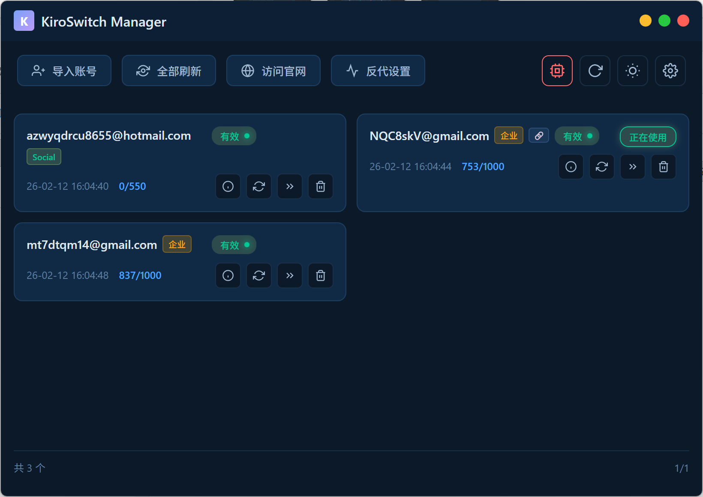
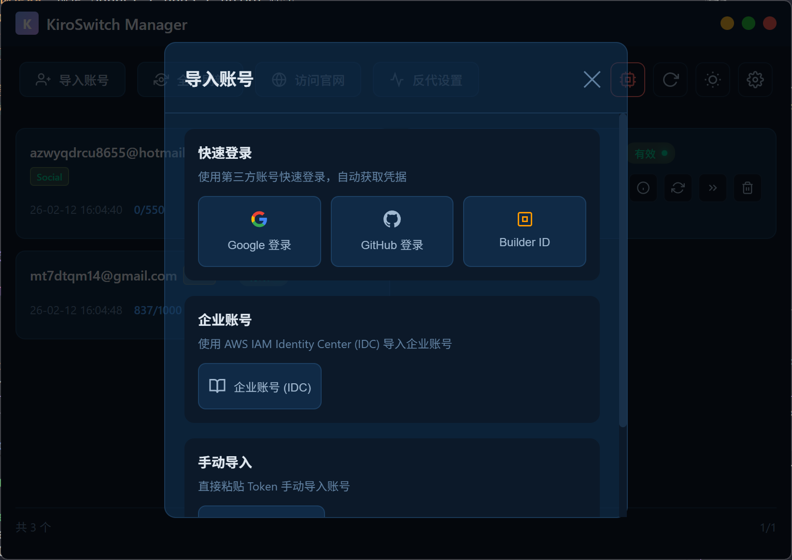
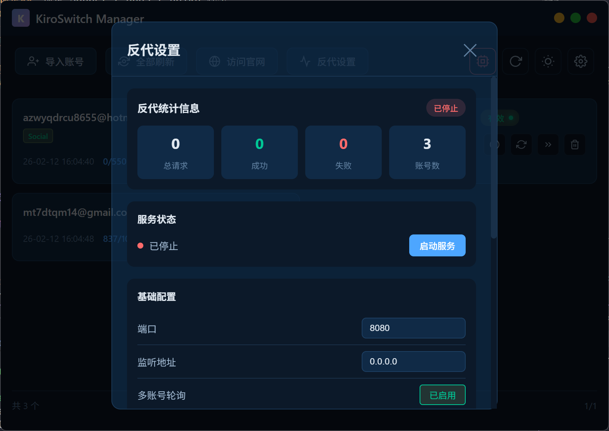
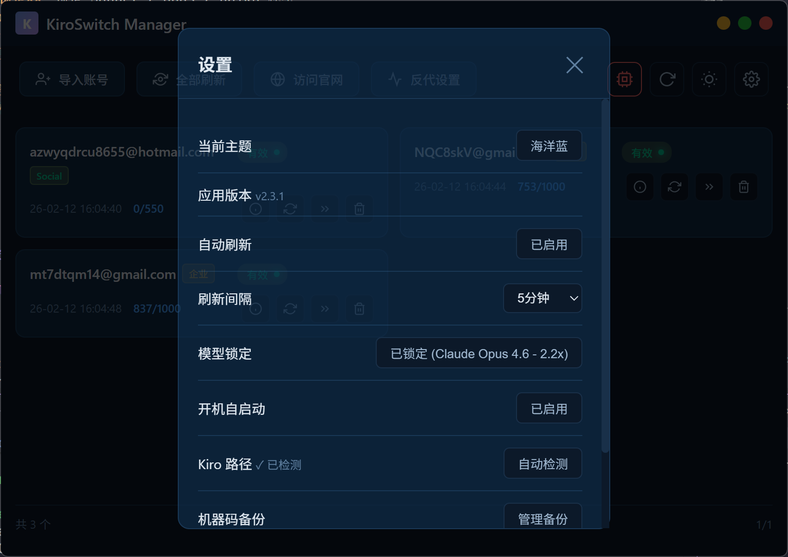

<div align="center">

# ⚡ KiroSwitch Manager

### Kiro IDE 多账号管理 & API 代理工具

[](https://github.com/zeoak9297/KiroSwitchManager/releases/latest)
[](https://github.com/zeoak9297/KiroSwitchManager/releases)
[](https://github.com/zeoak9297/KiroSwitchManager/releases/latest)
[](https://qun.qq.com/universal-share/share?ac=1&authKey=BomWk%2FawrYRpcRpyd0sPsAMx2UPhtHkb2ZobUBo6Yp9ozXKEPYtr3UMemrnePc3h&busi_data=eyJncm91cENvZGUiOiIxMDY1MjI0OTY0IiwidG9rZW4iOiJqME9xSk5wL1p2VzlRczg2MkR2K2JXVTlUdjZVTTB1UmxsQ3YyV3doT3RoNE1ua2xoSXJpWTQrUFBzSGc4TDRrIiwidWluIjoiMTg4NDQzNTQ4In0%3D&data=iG0O34ARO65vmvL_QL4gE7dYh72gUWhYsj5IbgmYX2b7owfmbGtjjVYHblk19DdULt617EydUiGtYF8OeztVew&svctype=4&tempid=h5_group_info)

<br/>

**一站式管理你的 Kiro IDE 账号，内置 Claude/OpenAI 兼容代理服务器**

</div>

---

## 🖼️ 界面预览

| 首页 | 账号管理 |
|:---:|:---:|
|  |  |

| 代理服务器 | 设置 |
|:---:|:---:|
|  |  |

---

## ✨ 功能特性

<table>
<tr>
<td width="50%">

### 🔄 多账号管理
- 支持 **Social**（Google/GitHub）、**AWS Builder ID**、**Enterprise IDC** 三种认证
- 一键切换账号，自动处理机器码绑定
- 自动刷新 Token，可配置刷新间隔
- 实时显示账号使用额度
- 自动检测账号封禁状态

</td>
<td width="50%">

### 🌐 API 代理服务器
- 兼容 **Claude API** 和 **OpenAI API** 格式
- 多账号负载均衡，自动轮询
- Token 桶限流（全局 + 单账号）
- 熔断器模式，自动隔离故障账号
- 支持流式 & 非流式响应

</td>
</tr>
<tr>
<td width="50%">

### 🔑 机器码管理
- **一账号一机器码**：切换时自动恢复绑定的机器码，避免频繁变动导致封号
- **软重置**：注入自定义 Machine ID，无需管理员权限
- **硬重置**：修改系统注册表（Windows 需管理员）
- **机器码备份**：手动备份/恢复当前机器码（注册表 + storage.json + custom-machine-id）
- 自动管理 Kiro 进程生命周期

</td>
<td width="50%">

### 🎨 更多特性
- **模型锁定**：锁定 Sonnet / Opus / Haiku 模型
- **Kiro 路径自动检测**：支持手动指定或自动检测安装路径
- **6 套主题**：深色、浅色、海洋蓝、梦幻紫、清新绿、玫瑰粉
- **自动更新检查**
- **开机自启动**
- **账号数据导出**
- **无边框窗口**，支持拖拽

</td>
</tr>
</table>

---

## 📦 安装

前往 [Releases](https://github.com/zeoak9297/KiroSwitchManager/releases/latest) 下载对应平台的安装包。

| 平台 | 文件 |
|:---:|:---:|
| 🪟 Windows x64 | `kiroswitch-manager-windows-amd64-v*.exe` |
| 🍎 macOS Universal | `kiroswitch-manager-macos-universal-v*.zip` |
| 🐧 Linux x64 | `kiroswitch-manager-linux-amd64-v*` |

> **Windows 用户**：下载 `.exe` 后直接双击运行，建议以管理员身份运行以获得完整的机器码重置能力
>
> **macOS 用户**：解压 `.zip` 后将 `.app` 拖入 Applications 文件夹，首次运行如遇安全提示，前往 系统设置 → 隐私与安全性 → 允许运行
>
> **Linux 用户**：下载后赋予执行权限 `chmod +x kiroswitch-manager-linux-amd64-*` 后运行

---

## 🚀 快速开始

1. 下载并启动 KiroSwitch Manager
2. 点击 **导入账号**，选择认证方式（推荐 Social 登录）
3. 完成授权后，账号自动出现在列表中
4. 点击账号即可一键切换（自动处理机器码绑定 + 切换凭证 + 启动 Kiro）

---

## 📖 使用指南

### 机器码绑定（一账号一机器码）

切换账号时，系统会自动处理机器码：

- **首次切换**：自动生成新机器码并绑定到该账号
- **再次切换**：自动恢复该账号绑定的机器码，不再重复生成

这样每个账号始终使用同一个机器码，避免频繁变动被检测。绑定数据保存在本地配置文件中。

在账号详情中可以查看绑定状态，也可以手动绑定/解绑。

### 机器码备份

在 **设置 → 机器码备份 → 管理备份** 中，可以手动备份当前机器码：

- **备份内容**：注册表 MachineGuid（Windows）、storage.json 遥测 ID + custom-machine-id
- **恢复**：一键恢复到指定备份的机器码状态
- **删除**：清理不需要的备份记录
- **跨平台**：Windows 备份含注册表，macOS/Linux 备份软重置相关文件

### 代理服务器

启动代理后，可直接对接支持 Claude/OpenAI API 的第三方工具。

```bash
# Claude API 格式
curl http://localhost:8080/v1/messages \
  -H "x-api-key: YOUR_API_KEY" \
  -H "Content-Type: application/json" \
  -d '{
    "model": "claude-sonnet-4-20250514",
    "max_tokens": 1024,
    "messages": [{"role": "user", "content": "Hello"}]
  }'
```

```bash
# OpenAI API 格式
curl http://localhost:8080/v1/chat/completions \
  -H "Authorization: Bearer YOUR_API_KEY" \
  -H "Content-Type: application/json" \
  -d '{
    "model": "claude-sonnet-4-20250514",
    "messages": [{"role": "user", "content": "Hello"}]
  }'
```

> API Key 在代理设置面板中查看，首次启动时自动生成。

### 模型锁定

支持锁定以下模型，防止 Kiro 自动切换：

| 模型 | 倍率 |
|:---:|:---:|
| Claude Opus 4.6 | 2.2x |
| Claude Opus 4.5 | 2.2x |
| Claude Sonnet 4.5 | 1.3x |
| Claude Sonnet 4 | 1.3x |
| Claude Haiku 4.5 | 0.4x |

---

## 📝 源码说明

本仓库仅发布编译好的安装包，不提供源码。前往 [Releases](https://github.com/zeoak9297/KiroSwitchManager/releases/latest) 下载。

**⚠️ 本项目永久免费！如果有人向你收费，你被骗了！**

---

## 📄 许可证

Copyright © 2025-2026 KiroSwitch. All rights reserved.

本软件仅供个人学习和研究使用。

---

<div align="center">

**如果觉得有用，请给个 ⭐ Star 支持一下！**

[](https://star-history.com/#zeoak9297/KiroSwitchManager&Date)

</div>